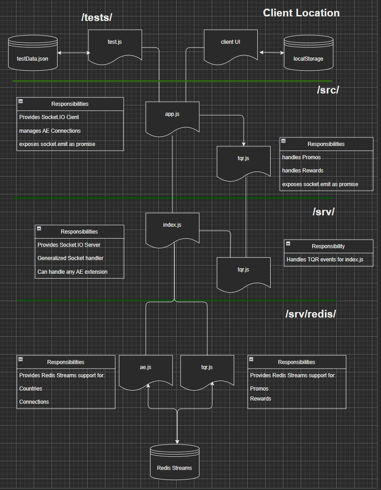

# AEgis/TQR Framework

AEgis implements *anonymous engagement* as the base capability for TQR.

## Design

AEgis uses web sockets implemented by `Socket.IO` to communicate between javascript clients and a `nodejs` server.

The server handles calls to `Redis Streams` directly using `ioredis`.

A consistency in code design wraps each `socket.io` event in a `Promise`. We use a functional style of programming for readability and to match the efficiency of `Promise` chains [1].

## Folder Structure

Files are distributed across appropriate folders/locations:



## Code Stucture

The `/tests/tests.js` and `/src/app.js` files provide a refence implementation of AEgis. Here, for example, are the two compositions that test adding entries to Redis Streams or fetching data from those entries:

```js
notice('Connecting...');
app
  .connectMe() // give app a socket 
  .then(() => tqr.connectMe()) // give tqr a socket of its own
  .then(() => notice('Connected'))
  .then(() => {
    if (reset) {
      testAdds();
    }
    testGets();
  });

const testAdds = compose(
  testAddAnon,        // add anonymous connection(s)
  testAddPromotions,  // add promotions to Redis, and pass nothing
  testAddConnctions,  // add connections and pass promotions simultaneously
  db.getConnections   // first, get data, then pass connections
);
const testGets = compose(
  testGetPromotions,
  testGetConnections,
  testGetCountries
);
```

> NOTE:
> Our test code uses functional composition to move results through the composition.  For example, `testAdds` and `testGets` move from right to left or bottom to top. The first step in `testAdds` then is to fetch json from the local database; `db.getAllConnections()` passes its output directly to the `testAddConnections()` function.

### Test Functions

Here's how test code dereferences typical `app` and `tqr` methods:

#### Tests in src/app.js

```js
const testAddConnctions = (connections) => {
  log(`Testing onAddConnection with ${connections.length} connections`);
  connections.forEach((connection) => {
    jLog(connection, 'connection');
    app //app.js handles all ae calls
      .onAddConnection(connection)
      .then((result) => printResults(`Test Passed: new connection`, result))
      .catch((e) => error(jLog(e, 'Error in onAddConnection() chain')));
  });
  // interesting...adding connections is orthogonal to add promos
  // so to enable the next step in tests, we can pass on the connectionsWithPromos
  // while we are adding connections
  return db.getConnectionsWithPromos();
};
```

#### Tests in stc/tqr.js

The `testAddPromotions()` function is almost identical to `testAddConnections()`. the main difference it the former calls `tqr.onAddPromotion()`, instead.

```js
const testAddPromotions = (connections) => {
  log('testing onAddPromotions');
  connections.forEach((connection) => {
    jLog(connection, 'connection', clc.green);
    tqr  // tqr.js handles tqr functions exclusively
      .onAddPromotion(connection)
      .then((result) => printResults(`\tTest onAddPromotion() PASSED`, result))
      .catch((e) => error(jLog(e, 'Error in onAddPromotions() chain')));
  });
};
```

### Client Functions

Client functions consist in promisified socket.io event emitters and socket.io event handlers (such as socket.on('newPromo)).

> NOTE: Client functions are in the /src folder

Here are the functions exposed by app.js:

```js
module.exports = {
  connectMe,
  onAddAnonConnection,
  onAddConnection,
  onGetConnections,
  onGetCountries,
  keyDelimiter,
  onTest,
};
```

The `src/app.onAddConnection()` function wraps each `connection` (consisting in the `country` and `nonce` properties) in a `Promise`. The `Promise` emits an event on `Socket.IO` along with the `country` and `nonce` values from the `connection`. the `socket.emit` function includes the `resolve()` function in the `Promise`  as a callback function. This function returns the server results to the clients (e.g., `tests.js`).

```js
const onAddConnection = ({ country, nonce }) =>
  new Promise((resolve) =>
    socket.emit('addConnection', country, nonce, newConn =>
      resolve(newConn)
    )
  );
```

### Server Functions

The `srv/index.js` file manages `Socket.IO` and communicates directly with `Redis Streams` using the `ioredis` package.

The `src/app.js` file connects to `srv/index.js` by resolving this `Promise` [2]:

```js
const connectMe = () => Promise.resolve(socket.connect());
```

The `index.js` file handles the `socket` in the `io.on('connection')` event handler every time a client logs on to the server.

We use a single connection event handler for simplicity and readability. It is easier to maintain, as well (e.g., adding support for `Rewards`).

```js
io.on('connection', (socket) => {
  socket.onAny((event, ...args) => {
    jLog(args, event);

    const methods = {
      addConnection: onAddConnection,
      getCountries: onGetCountries,
      getConnections: onGetConnections,

      addPromo: onAddPromo,
      getPromos: onGetPromos,

      test: onTest,
    };

    methods[event](args, socket, io);
  });
  ```

The `methods` object treats functions as data and maps event names (e.g., `addConnection`) to function implementations inside `index.js` (e.g., `onAddConnection`) . The handler than calls the appropriate function in `index.js` along with the event's arguments. Some functions require a reference to either the `socket` object or the `io` object, too.

Here is the `onAddConnection()` function for `srv/index.js`:

```js
const onAddConnection = (args, socket) => {
  // strip off any callback function to get properties for Redis
  const props = args.slice(0, -1);
  const ack = args.at(-1);
  const [country, nonce, lastDeliveredId] = props;
  jLog(props, 'props:');

  ae.addConnection(country, nonce)
    .then((id) => joinSocketRoom(socket, country, nonce, lastDeliveredId, id))
    .then((conn) => safeAck(ack, conn));
};
```

First, we separate the argument properties from the callback, then we pass the `country` and `nonce` properties to the `Promise` in the Redis `ae` client code in the `/srv/redis` folder.

The Redis `addConnection()` function returns a `Promise` that resolves to the stream ID of the new connection.

The second `Promise` adds this `id` value to the args of the `joinSocketRoom()` function (that handles some `socket.io` details), then the Promise passes the new `conn` object on to the `safeAck()` function (which ensures there is a callback funtion before returning the `id` to the client; viz., `onAddConnection()` in `tests.js`).

 Remember, the client code uses the results of the event's callback as the value of the `Promise resolve()` function; and the `resolve()` function returns the value to `testAddConnctions()` function on the client. A UI would use a different function, of course.

## End Notes

> [1] Everything in AEgis and TQR are chained together either through socket events, `Promise` chains, or functional composition.
>
> By convention, we name events with minimal names such as '`addConnection`' (see above).
>
> Any subsequent event handler maps an event name to an event handler by add 'on' to the event name. See `addConnection:onAddConnection` above.
> [2] A more sophisticated version of the connection function will look something like this:
>
> ```js
> io.connectAsync = function(url, options) {
>     return new Promise(function(resolve, reject) {
>         io.connect(url, options);
>         io.once('connect', function(socket) {
>             resolve(socket);
>         });
>         io.once('connect_error', function() {
>             reject(new Error('connect_error'));
>         });
>         io.once('connect_timeout', function() {
>             reject(new Error('connect_timeout'));
>         });
>     });
> }
> 
> io.connectAsync().then(function(socket) {
>     // connected here
>     socket.on('someMsg', function() {
>        // process message here
>     });
> }, function(err) {
>     // error connecting here
> });
> ```
>